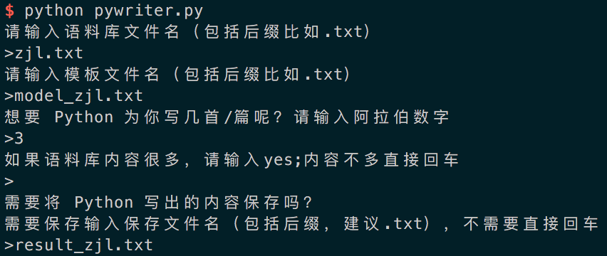
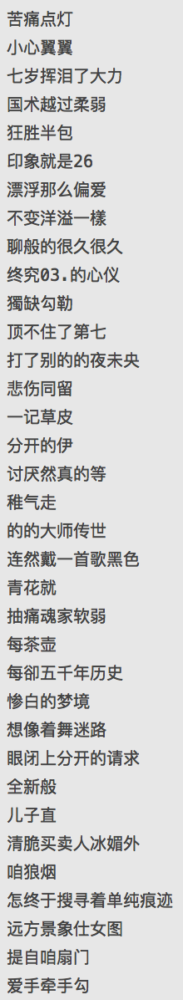
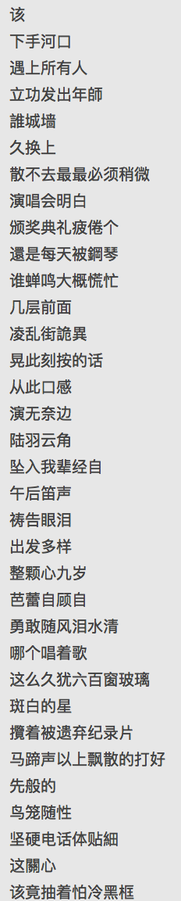
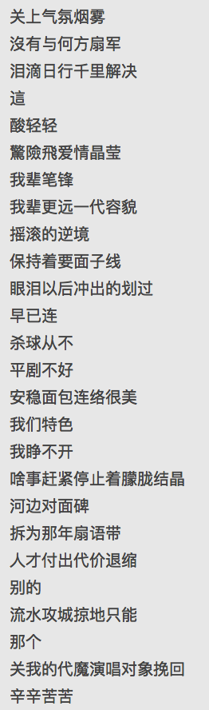
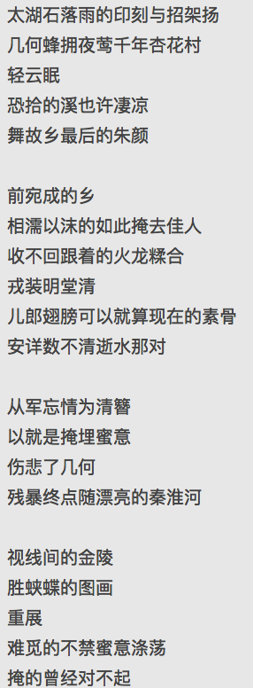
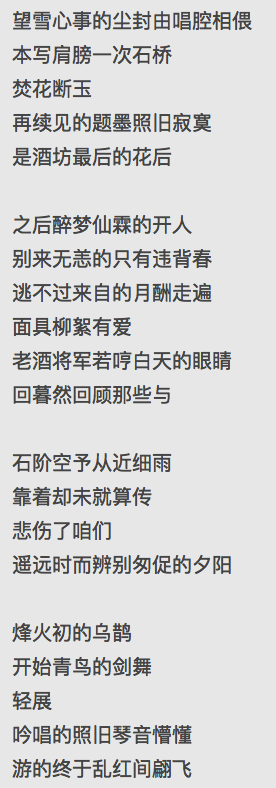
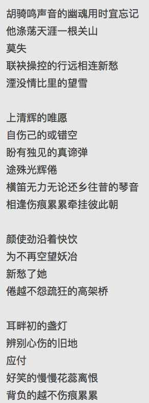

# pyWriter
**Python 为你写诗**
  
Inspired By [恶俗古风自动生成器](http://www.jianshu.com/p/f893291674ca)  
原PO真的很233啊，于是自己写个更通用的玩一玩。 
  
## System Requirements:

- Python 2.7.10  
- pip
- (Optional) [virtualenv](https://virtualenv.pypa.io/en/latest/)  

## To start

```bash
# Clone the repo
git clone https://github.com/PeggyZWY/pyWriter
cd pyWriter

# Create a new virtual environment (optional, but recommended)
virtualenv venv
source venv/bin/activate

# Install requirements
pip install -r requirements.txt  
```  

准备好语料库（尽量多一点，比如从“XXX歌词大全”、“XXX诗集”里找）和要写的模板（选一首具体的歌或者诗词），推荐就用 .txt 格式。  
  
继续输入`python pywriter.py`，回车后根据提示输入。比如：
  
  
  
## Examples  
### No.1 Python 周杰伦  
*（画外音：活着不好吗？）*   
 
从百度文库下了个“周杰伦歌词全集”作为语料库，模板使用“烟花易冷”。  
**结果(三张图连起来是一首)：**  
  
  
  
  
都是什么鬼？！又试了几首，也都是非常的。。。毕竟 Jay 这么有才华的人不可能能被这个小程序超越啊！  
  
### No.2 Python 汪峰  
*（画外音：那看看皮裤汪吧？）*    
  
**结果：**   
  
  
∑(っ °Д °;)っ  
  
### No.3 Python 古风  
*（画外音：额。。窝们回到最初去看看古风歌曲怎么样？）*  
  
**结果：**  
①   
  
②  
  
③  
  
  
看起来还真像那么一回事啊 (￣▽￣")   果然老本行还是可以的！  
  
**各位玩得开心 :)**
  
 
